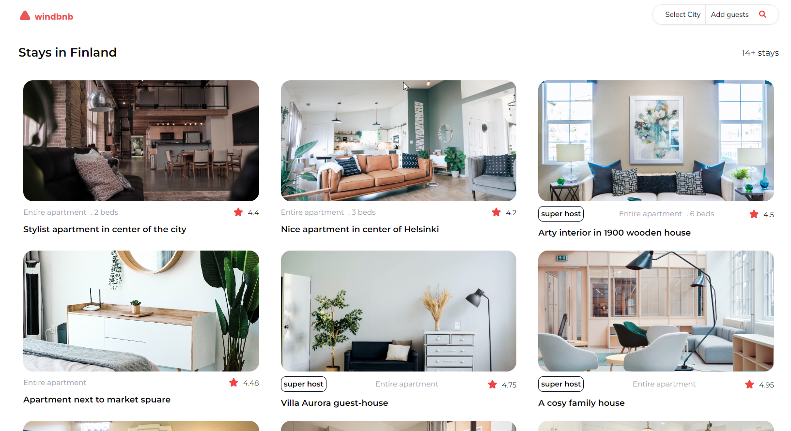

<!-- Please update value in the {}  -->

<h1 align="center">Weather app</h1>

<div align="center">
   Solution for a challenge from  <a href="http://devchallenges.io" target="_blank">Devchallenges.io</a>.
</div>

<div align="center">
  <h3>
    <a href="https://windbnb-dusky.vercel.app/" target="_blank">
      Demo
    </a>
    <span> | </span>
    <a href="https://devchallenges.io/solutions/yilgjYXtwan7by4oOpwQ" target="_blank">
      Solution
    </a>
    <span> | </span>
    <a href="https://devchallenges.io/challenges/3JFYedSOZqAxYuOCNmYD" target="_blank">
      Challenge
    </a>
  </h3>
</div>

<!-- TABLE OF CONTENTS -->

## Table of Contents

- [Overview](#overview)
- [Installation](#installation)
- [Built With](#built-with)
- [Features](#features)
- [Acknowledgements](#acknowledgements)


<!-- OVERVIEW -->

## Overview



#### Installation:

1. Clone the repository:

   ```bash
   git clone https://github.com/render217/windbnb
   ```

2. Navigate into the directory and install dependencies:

   ```bash
   npm install
   ```

3. Start the development server:
   ```bash
   npm run dev
   ```

### Built With

<!-- This section should list any major frameworks that you built your project using. Here are a few examples.-->

- **React** - Web framework used.
- **Tailwind** - A utility-first CSS framework


## Features

<!-- List the features of your application or follow the template. Don't share the figma file here :) -->

This application/site was created as a submission to a [DevChallenges](https://devchallenges.io/challenges) challenge. The [challenge](https://devchallenges.io/challenges/wBunSb7FPrIepJZAg0sY) was to build an application to complete the given user stories.


- User story: I can see a list of properties
- User story: I can see the property card with a name, rating, apartment type, and super host
- User story: I can open the filter drawer
- User story: I can filter properties by location and number of guests
- User story: I can see the number of filtered items
- User story: I can see pages following given designs

## Acknowledgements
- [Font Awesome](https://fontawesome.com)
- [Vercel](https://vercel.com/)


